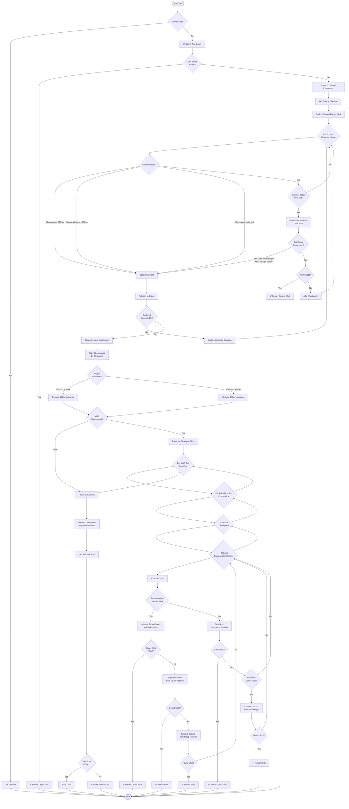

# Movement Look-Ahead System Documentation

## Overview

The Movement Look-Ahead System is Combat Crocs' intelligent spatial exploration engine that finds optimal shooting positions by simulating physics-based movement, terrain navigation, and strategic positioning before each turn.

**Core Goal:** Find a position where the AI can safely damage the enemy while avoiding self-damage.

**Key File:** `ai/training/movement-lookahead.js`

**Main Entry Point:** `findBestShootingPosition(page, gameState)`

---

## Architecture: Three-Phase Exploration

The system uses a **phased exploration strategy** that attempts increasingly complex movements:

1. **Phase 0: Origin Testing** - Can we shoot safely from current position?
2. **Phase 1: Ground Exploration** - Walk left/right to find better positions
3. **Phase 2: Jump Exploration** - Jump from checkpoints to reach elevated terrain
4. **Phase 3: Fallback** - Use best position found, even if not ideal

Each phase stops immediately upon finding a safe shot. Phases are only attempted if previous phases failed.

---

## Complete Flow Diagram



---

## Phase Details

### Phase 0: Origin Testing

**Location:** `findBestShootingPosition()` lines 479-495

**Purpose:** Check if we can shoot safely without moving

**Logic:**

```javascript
const originShot = await testShot(page);
if (originShot.canShoot) {
  return { finalPosition: origin, shotDecision: originShot.shotResult };
}
```

**Why:** Saves time - if current position is already good, no need to explore

---

### Phase 1: Ground Exploration

**Location:** `exploreGroundFromPosition()` lines 509-679

**Purpose:** Walk left/right to find better shooting positions

#### Key Innovation: Enemy-Directed Exploration

**Code:** Lines 512-532

**Logic:**

```javascript
const enemyDirection = enemy.x > player.x ? "right" : "left";
const oppositeDir = enemyDirection === "left" ? "right" : "left";
const directions = [enemyDirection, oppositeDir]; // Enemy first!
```

**Why:** Prioritizes movement toward the enemy, maximizing chances of finding useful positions before exploring away from target.

#### Continuous Fluid Movement

**Code:** Lines 541-562

**How it works:**

1. Press and HOLD arrow key (simulates player holding key)
2. Game physics updates every frame (~16ms)
3. Player naturally navigates terrain, climbs slopes, slips on steep surfaces
4. Sample position every 15px traveled
5. Stop when: no progress for 600ms OR no net advancement for 1000ms

**Why fluid vs discrete:** Allows physics to naturally resolve steep terrain climbing instead of fighting it with discrete steps.

#### Net Progress Tracking (Oscillation Tolerance)

**Code:** Lines 569-578

**Problem:** Steep terrain causes oscillation (719 → 686 → 719 → 686...)

**Solution:**

```javascript
let furthestXReached = startPos.x;
let timeSinceAdvancing = 0;

const netAdvancement = direction === "right" ? currentX - furthestXReached : furthestXReached - currentX;

if (netAdvancement > 5) {
  // Any 5px+ forward movement
  furthestXReached = currentX;
  timeSinceAdvancing = 0; // Reset timer!
}
```

**Thresholds:**

- **5px net advancement:** Resets stuck timer (allows oscillation)
- **1000ms timeout:** Stops if no 5px+ advancement for 1 second (true wall)

**Why:** Distinguishes between walkable steep terrain (oscillates but advances) and true walls (zero advancement).

#### Dense Checkpoint Sampling

**Code:** Lines 595-599

**Spacing:** Every 15px traveled (reduced from 25px)

**Why:** Player moves ~14px per 20ms check. 15px spacing ensures we capture narrow 100px escape zones with 6-7 samples instead of 2-3.

#### Regression Detection (Platform Fall-Off Prevention)

**Code:** Lines 633-650

**Purpose:** Detect when player falls off elevated platforms

**Logic:**

```javascript
const elevationLoss = currentY - startY;          // Lost 319px
const distanceRegression = currentDist - startDist; // +250px further

if (elevationLoss > 50 && distanceRegression > 100) {
  console.log("⚠️ Regression: lost height + further from enemy");
  break; // Stop, teleport back!
}
```

**Example - Metal Coaster:**

- Start: (496, 266), 150px from enemy
- Walk left: (237, 585) - fell 319px, now 400px from enemy
- **Regression detected!** → Stop, return to (496, 266), try jumping instead

**Why:** Prevents wasting time exploring ground-level positions after successfully reaching elevated terrain.

---

### Phase 2: Jump Exploration

**Location:** `exploreJumpsFromCheckpoints()` lines 684-931

**Purpose:** Jump from discovered checkpoints to reach elevated terrain

#### Context-Aware Clearance Threshold

**Code:** Lines 765-780

**Logic:**

```javascript
const originElevation = state.checkpoints[0]?.pos.y || 500;
const minClearance = originElevation > 450 ? 400 : 250;
```

**Thresholds:**

- **Ground level (y > 450):** Require 400px clearance
  - **Why:** High jumps from ground need ceiling clearance
- **Elevated (y ≤ 450):** Require 250px clearance
  - **Why:** Already high up, can navigate under overhangs (metal coaster protrusions)

**Example - Metal Coaster Overhang:**

- Without: 330px clearance rejected → no jumps attempted ❌
- With: 330px > 250px → jumps attempted under overhang ✅

#### Multi-Tier Clearance Grouping

**Code:** Lines 801-806

**Logic:**

```javascript
const tierMap = new Map();
for (const cp of validCheckpoints) {
  const tier = Math.floor(cp.overheadClearance / 50) * 50;
  tierMap.get(tier).push(cp);
}
```

**Why:** Ensures we exhaust all positions with 590px clearance before trying 340px positions, maximizing jump safety.

#### Spatial Exploration Order

**Code:** Lines 811-858

**Order:**

1. Try **one direction** from **ALL** tier positions
2. Then try **opposite direction** from **ALL** tier positions

**Example:**

```
Tier 600px: (A, B, C)
  Try right from A, B, C
  Try left from A, B, C
Tier 300px: (D, E)
  Try right from D, E
  Try left from D, E
```

**Why:** Finds intermediate platforms (palm tree) that lead to final goal (metal coaster) by ensuring we discover palm tree before exhausting all metal coaster attempts.

#### Jump Chaining (Steep Terrain Navigation)

**Code:** Lines 882-924

**Problem:** Jump lands on steep slope → player slides to lower position

**Detection:**

```javascript
if (jumpResult.initialLanding !== jumpResult.newPos) {
  // Player slid! Try chaining from steep position
  const chainJump = await jump(page, direction, chainDuration);
}
```

**Chain Process:**

1. Land on steep position (496, 266)
2. Immediately try jumping again from steep position
3. Chain multiple jumps to climb higher
4. Example: Ground → Palm tree (steep) → Metal coaster (stable)

**Priority:**

1. Try jump chains (climb higher)
2. Explore ground from steep position
3. Use steep shot as fallback

**Why:** Steep landings are often stepping stones to better positions. Chaining unlocks multi-stage navigation.

---

### Phase 3: Fallback

**Location:** `findBestShootingPosition()` lines 505-525

**Purpose:** Use best position found, even if not ideal

**Logic:**

```javascript
const best = state.getBestCheckpoint() || { pos: origin };
const fallbackShot = await testShot(page);

if (fallbackShot.predictedLanding?.distToSelf < 150) {
  return { actionType: "skip" }; // Too dangerous!
}

return { finalPosition: best.pos, shotDecision: fallbackShot };
```

**Why:** Ensures AI always takes a turn (shoots or skips) rather than getting stuck in infinite exploration.

---

## Key Systems Reference

### Atomic Actions

**Location:** Lines 11-296

**Functions:**

- `testShot(page)` - Can we damage enemy without self-damage?
- `move(page, direction, distance)` - Physics-based walking
- `jump(page, direction, holdDuration)` - Execute jump with directional control
- `teleport(page, position)` - Instant position change
- `measureOverheadClearance(page, position)` - Raycast upward to measure clearance

**Design:** Pure, composable functions - each does ONE thing. Orchestrator combines them.

### State Management

**Location:** Lines 298-350

**Class:** `ExplorationState`

**Tracks:**

- `visitedPositions` - Set of "x,y" keys (prevents revisiting)
- `checkpoints` - Array of `{ pos, elevation, overheadClearance, score }`
- `currentCheckpoint` - Active exploration point

**Methods:**

- `hasVisited(pos)` / `markVisited(pos)` - Position tracking
- `addCheckpoint(pos, elevation, clearance)` - Store position of interest
- `getBestCheckpoint()` - Returns highest elevation checkpoint

---

## Constants & Thresholds

### Ground Exploration

| Constant                     | Value             | Purpose                             | Location      |
| ---------------------------- | ----------------- | ----------------------------------- | ------------- |
| `checkInterval`              | 20ms              | How often to sample position        | Line 560      |
| `checkpointSpacing`          | 15px              | Distance between checkpoint samples | Line 595      |
| `noProgressThreshold`        | 30 checks (600ms) | Stop if no forward movement         | Lines 573-578 |
| `netAdvancementThreshold`    | 5px               | Min progress to reset stuck timer   | Line 581      |
| `netAdvancementTimeout`      | 1000ms            | Stop if no 5px+ advancement         | Lines 587-590 |
| `regressionElevationLoss`    | 50px              | Min height loss for regression      | Line 643      |
| `regressionDistanceIncrease` | 100px             | Min enemy distance increase         | Line 643      |

### Jump Exploration

| Constant                     | Value                   | Purpose                       | Location |
| ---------------------------- | ----------------------- | ----------------------------- | -------- |
| `groundClearanceThreshold`   | 400px                   | Min clearance from ground     | Line 773 |
| `elevatedClearanceThreshold` | 250px                   | Min clearance when elevated   | Line 773 |
| `elevationBoundary`          | 450px (y-coord)         | Ground vs elevated cutoff     | Line 773 |
| `jumpDurations`              | [300, 500, 750, 1000]ms | Jump hold times to try        | Line 686 |
| `chainDurations`             | [750, 1500]ms           | Durations for steep chains    | Line 895 |
| `elevationGainThreshold`     | 10px                    | Min gain to explore from jump | Line 929 |
| `clearanceTierSize`          | 50px                    | Grouping granularity          | Line 803 |

### Fallback

| Constant                     | Value | Purpose                     | Location |
| ---------------------------- | ----- | --------------------------- | -------- |
| `dangerousDistanceThreshold` | 150px | Skip if explosion too close | Line 518 |

---

## Code Organization

```
movement-lookahead.js (934 lines)
├── ATOMIC ACTIONS (lines 11-296)
│   ├── testShot()
│   ├── move()
│   ├── jump()
│   ├── teleport()
│   └── measureOverheadClearance()
├── STATE MANAGEMENT (lines 298-350)
│   └── class ExplorationState
├── ORCHESTRATOR (lines 352-934)
│   ├── findBestShootingPosition() [MAIN ENTRY]
│   ├── exploreGroundFromPosition()
│   └── exploreJumpsFromCheckpoints()
```

---

## Future Improvements

### Known Issues

1. **Oscillation on very steep terrain** - Sometimes player jiggles 20+ times before stopping
   - **Solution:** Could add "velocity variance" detection - if position varies a lot but velocity stays low, it's oscillation
2. **Jump exploration can be slow** - Trying all 4 durations × 2 directions per checkpoint
   - **Solution:** Early termination if first 2 durations fail (likely blocked)
3. **No backtracking** - If we explore right and hit wall, we don't go back and try left-then-right path
   - **Solution:** Would need search tree instead of linear exploration

### Potential Optimizations

1. **Parallel shot testing** - Test multiple checkpoints simultaneously instead of sequentially
2. **Heuristic pruning** - Skip checkpoints that are clearly worse (lower elevation + further from enemy)
3. **Caching** - Store terrain clearance data to avoid repeated raycasts
4. **Adaptive timeouts** - Reduce net advancement timeout to 500ms after first few games (when familiar with map)

### Simplification Opportunities

1. **Combine similar code** - Ground exploration has duplicate logic for left/right
2. **Extract jump chain logic** - Currently inline, could be separate function
3. **Unified progress tracking** - Merge `noProgressCount` and `timeSinceAdvancing` into single system

---

## Integration Points

### Called By

**File:** `ai/training/movement-controller.js`
**Function:** `decideTurn()`
**Line:** ~50

```javascript
const movementResult = await findBestShootingPosition(page, gameState);
```

### Depends On

1. **TerrainScanner** (`src/utils/terrain-scanner.js`)

   - Provides `scanTerrainDistances()` for overhead clearance
   - Injected into browser context by `browser-injections.js`

2. **Look-Ahead Simulation** (`window.__runLookAheadSimulation__`)

   - Tests if shot will damage enemy
   - Injected by `browser-injections.js`

3. **Game Physics** (Phaser/Matter.js)
   - Movement, jumping, collision detection
   - Accessed via `scene.matter.body` API

---

## Debugging Tips

### Enable Verbose Logging

All console.log statements include emojis for easy filtering:

- 🔍 = Exploration progress
- 📍 = Checkpoint added
- 🚶 = Ground movement
- 🦘 = Jump attempt
- ✅ = Success
- ⚠️ = Warning/stopped

### Common Issues

**Player not moving:**

- Check `scene.cursors.left/right.isDown` - may not be releasing keys
- Verify physics enabled: `player.body` should exist

**Jumps not working:**

- Check `measureOverheadClearance()` - may be returning 0
- Verify clearance threshold - elevated positions use 250px, not 400px

**Infinite loops:**

- Check net advancement tracking - `furthestXReached` should update
- Verify `timeSinceAdvancing` resets when `netAdvancement > 5px`

**Falls off platforms:**

- Check regression detection - should trigger at 50px height loss + 100px distance increase
- Verify exploration order - enemy direction should be tried first

---

## Testing Scenarios

### Scenario 1: Ground Level → Flat Terrain

- **Expected:** Phase 1 finds shot, never attempts jumps
- **Checkpoints:** ~10-15 ground positions
- **Duration:** ~1-2 seconds

### Scenario 2: Stuck Between Obstacles (Metal Coaster Gap)

- **Expected:** Phase 1 finds NO valid positions, Phase 2 jumps to palm tree then metal coaster
- **Checkpoints:** ~5 ground + 2 elevated
- **Duration:** ~3-5 seconds

### Scenario 3: Enemy on High Platform

- **Expected:** Phase 1 walks to base, Phase 2 jump chains up platform
- **Checkpoints:** ~8 ground + 3-4 jump positions
- **Duration:** ~4-6 seconds

---

## Summary

The Movement Look-Ahead System is a **three-phase exploration engine** that:

1. **Tests origin** (0.1s)
2. **Walks intelligently** toward enemy with oscillation tolerance (1-2s)
3. **Jumps strategically** from best positions with context-aware clearance (2-4s)
4. **Falls back** to best position found

**Total exploration time:** 3-7 seconds per turn in headed mode, <1s in headless mode (optimizations applied).

**Key innovations:**

- Enemy-directed exploration (always moves toward target first)
- Net progress tracking (tolerates steep terrain oscillation)
- Regression detection (prevents platform fall-off exploration)
- Context-aware thresholds (navigates overhangs when elevated)
- Jump chaining (multi-stage navigation via steep slopes)

**Result:** AI that naturally navigates complex terrain like a skilled player would!
